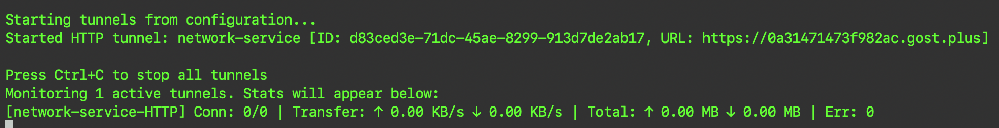
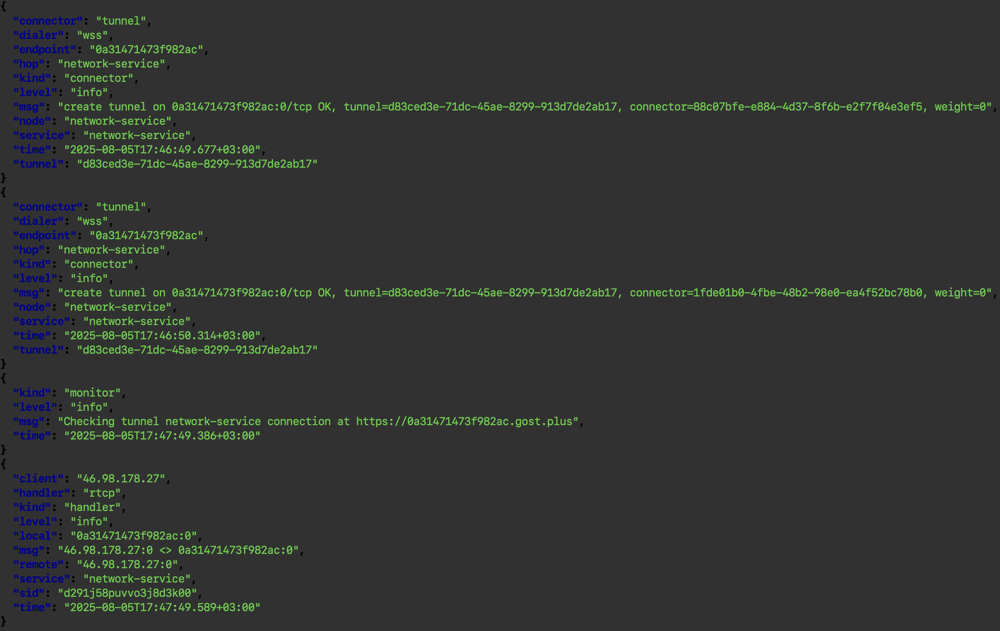

# GOST-PLUS CLI Tunnel

A high-performance, cross-platform and secured command-line client designed to tunnel local network services securely to the public network using the [GOST.PLUS](https://gost.plus) infrastructure.<br>

It provides _ngrok_-like functionality exposing local HTTP, TCP, UDP resources and files  through encrypted tunnels with a minimal configuration.

## Definitions

### Tunnels
Tunnels are outbound connections from your local address to the GOST.PLUS infrastructure. They expose your local services to the internet through secure, encrypted connections.

### Entrypoints
Entrypoints are the receiving ends that connect to your tunnels. They listen to a local address, connect to a remote tunnel and forward incoming traffic through the established tunnel to the mapped local address. Each entrypoint must be paired with a tunnel using a unique tunnel ID.

## Supported Tunnels:
* **HTTP Tunnel** - Exposes local web servers
* **File Tunnel** - Share local folders via web interface
* **TCP Tunnel**  - Forward any TCP service (e.g., databases, SSH)
* **UDP Tunnel**  - Forward UDP traffic (e.g., DNS, gaming)

## Supported Entrypoints:
* **TCP Entrypoint** - Connects to the remote address of a TCP tunnel by tunnel id
* **UDP Entrypoint** - Connects to the remote address of a UDP tunnel by tunnel id

## Features:
- 💻 **Cross-Platform Support**: Runs and builds seamlessly on Linux, macOS, and Windows
- 🚀 **Zero Configuration Mode**: Start tunneling with a single command
- 🔧 **Configurable & Scriptable**: YAML config support and CLI flags
- 💊 **Tunnel Monitoring & Auto-Recovery**: Automatic tunnel health monitoring and self-recovering
- 🛠️ **Integrated Logging & Stats**: Real-time connection metrics and JSON logging for diagnostics
- ⚙️ **Systemd Service Integration**: Easy deployment as a system service on Linux

## Security
- **End-to-End Encryption**: All tunnel traffic is encrypted
- **Authentication**: Built-in support with username/password authentication for HTTP and File tunnel types
- **TLS Support**: Secure your HTTP tunnels with TLS encryption
- **Password encoding**: Password on a configuration file is automatically encoded in Base64 format for basic protection against casual viewing.

## Use Cases:
- IoT device connectivity on edge devices such as Raspberry Pi
- Ideal for rapid prototyping
- Webhook testing and remote access to local environments
- Private API exposure
- Secure file sharing for collaboration

## Screenshots

### Running with stats



### Logging output




### Build Console App:
```bash
go build -ldflags="-s -w" -o gost-tunnel main.go
# or for the current platform
make 
# see Makefile for more details
```

### Get started
1. Generate a secure 12-character password:
```bash
openssl rand -base64 12
```

2. **Create and start a HTTP tunnel**:
Feel free to create multiple ones.
```bash
# for the first time
gost-tunnel --local 127.0.0.1:8080 \
      --tunnel_type http \
      --name rpi-service \
      --username user \
      --password my_password \
      --stats-interval 2s

# next time just run
gost-tunnel
```
**Note:** It's tested on `Raspberry Pi Zero 2W` and macOS hosts. Use it on your own risk.

3. **Watch logs** with `jq`:
```bash
# Linux
tail -f /home/[user]/.config/gost.plus/logs/gost-plus.log | jq -C .
```

4. **Using Entrypoints** (connect to Remote Tunnels)
   
   **On Machine A (with the service):**
   ```bash
   # Create a TCP tunnel to expose local SSH server (port 22)
   gost-tunnel --local 127.0.0.1:22 \
         --tunnel_type tcp \
         --name "SSH Tunnel for RPI" \
         --stats-interval 2s
   
   # Note the Tunnel ID from the output, e.g.: "Tunnel ID: abc123..."
   ```
   
   **On Machine B (client machine):**
   ```bash
   # Create a TCP entrypoint that connects to the tunnel
   gost-tunnel --entrypoint --tcp \
         --local localhost:2222 \
         --tunnel_id "abc123..." \
         --name "SSH Access to RPI"
   
   # Now you can connect to the remote SSH server using:
   # ssh -p 2222 user@localhost
   ```

   **For UDP services (like DNS):**
   ```bash
   # On Machine A (with DNS server):
   gost-tunnel --local 127.0.0.1:53 \
         --tunnel_type udp \
         --name "DNS Tunnel"
   
   # On Machine B (client):
   gost-tunnel --entrypoint --udp \
         --local 127.0.0.1:553 \
         --tunnel_id "tunnel-id-here" \
         --ttl 120 \
         --name "DNS Entrypoint"
   ```

5. Run it as a systemd service in the background on Linux (optional):
```bash
chmod +x ./install.sh
./install.sh
```

## Command Line Arguments

### Global Options:
```
--help                   Show help information
--version                Show version information
--no-stats               Disable statistics for daemon mode
--stats-interval         Stats update interval (default: 1s)
--monitor-interval       Tunnel connection monitoring interval (default: 1m)
```

### Tunnel Management:
```
--local <endpoint>       [REQUIRED] Local endpoint to listen on (e.g., 127.0.0.1:8080)
--tunnel_type <type>     Tunnel type: http, file, tcp, udp (default: http)
--name <name>            Name for the tunnel (optional)
--username <user>        Username for authentication (for http, file tunnel types)
--password <pass>        Password for authentication (for http, file tunnel types)
--hostname <host>        Rewritten hostname on headers (optional)
--tls                    Enable TLS (optional)
--tunnel_id <id>         Specify a custom tunnel ID (optional)
```

### Entrypoint Options:
```
--local <endpoint>      [REQUIRED] Local endpoint to forward to (e.g., 127.0.0.1:22)
--entrypoint             Create an entrypoint instead of a tunnel
--tcp                    Use TCP protocol for entrypoint
--udp                    Use UDP protocol for entrypoint
--ttl <seconds>          Time to live for UDP entrypoint in seconds (optional)
```

### List and Delete:
```
--list                   List all tunnels and entrypoints
--tunnels                List all tunnels
--entrypoints            List all entrypoints
--delete <id>            Delete tunnel or entrypoint by ID
```

## Examples

### Basic Usage:
```bash
# Start all configured tunnels and entrypoints
gost-tunnel

# Show help
gost-tunnel --help

# Show version
gost-tunnel --version
```

### Tunnel Creation:
```bash
# Create a simple HTTP tunnel
gost-tunnel --local localhost:8080 --name "web-app"

# Create HTTP tunnel with TLS
gost-tunnel --local 127.0.0.1:3000 --tunnel_type http --name "secure-app" --tls

# Create a TCP tunnel
gost-tunnel --local 192.168.1.100:22 --tunnel_type tcp --name "SSH Access"
```

### Entrypoint Creation:
```bash
# Create a TCP entrypoint
gost-tunnel --entrypoint --tcp --local localhost:2222 --tunnel_id "tunnel-id-here" --name "SSH Access"

# Create a UDP entrypoint with TTL
gost-tunnel --entrypoint --udp --local localhost:553 --tunnel_id "tunnel-id-here" --name "DNS Server" --ttl 120
```

### Management:
```bash
# List all tunnels and entrypoints
gost-tunnel --list

# List all tunnels
gost-tunnel --tunnels

# List all entrypoints
gost-tunnel --entrypoints

# Delete a tunnel or entrypoint by ID
gost-tunnel --delete "tunnel-or-entrypoint-id"

# Run in daemon mode without statistics
gost-tunnel --no-stats
```

### Advanced Usage:
```bash
# Custom stats update and monitoring intervals
gost-tunnel --local 127.0.0.1:8080 \
      --stats-interval 2s --monitor-interval 2m \
      --username user \
      --password my_password \
      --hostname "apphost_name" \
      --name "web-app" \
      --tls
```

### Configuration and folders

**MacOS**
- app dir: /Users/[user]/Library/Application Support/gost.plus
- app configuration file: /Users/[user]/Library/Application Support/gost.plus/config.yml
- app log file: /Users/[user]/Library/Application Support/gost.plus/logs/gost-plus.log

**Linux**
- app dir: /home/[user]/.config/gost.plus
- app configuration file: /home/[user]/.config/gost.plus/config.yml
- app log file: /home/[user]/.config/gost.plus/logs/gost-plus.log

### Log monitoring
- Keep track pretty formatted logs:
```bash
tail -f "/Users/[user]/Library/Application Support/gost.plus/logs/gost-plus.log" | jq -C .
```

- Keep track logs without formatting
```bash
tail -f "/Users/[user]/Library/Application Support/gost.plus/logs/gost-plus.log" | jq -c .
```

## Unit Testing

### Mocks generating
```bash
# Generate mocks for all interfaces
mockery --config=.mockery.yaml
```

### Running Tests

```bash
# To run all Unit tests:
xgo test -v ./tests/...

# To run specific Unit tests on a file:
xgo test -v ./tests/stats/stats_test.go

xgo test -v ./tests/utils/...

# To run a single test case:
xgo test -v -run ^TestGetState$ ./tests/utils/tunnel_test.go

xgo test -v -run TestDisplayStats_Shows_LatestStats_ForEntrypoints ./tests/stats/...
```

Start tests explorer on web browser:
```bash
xgo e
```

### Test Coverage

Check test coverage with the following commands:

```bash
# Generate coverage profile
xgo test -cover -coverpkg=./... -coverprofile=coverage.out ./...
# or
xgo test -cover -coverpkg=./runner/task/... -coverprofile=coverage.out ./...

# View coverage on Web browser
go tool cover -html=coverage.out
# or view the coverage on terminal
go tool cover -func=coverage.out

# Save coverage report to HTML file
go tool cover -html=coverage.out -o coverage.html
```
