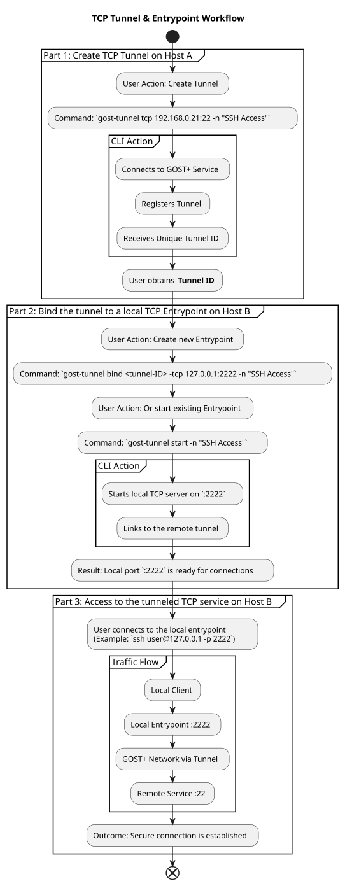
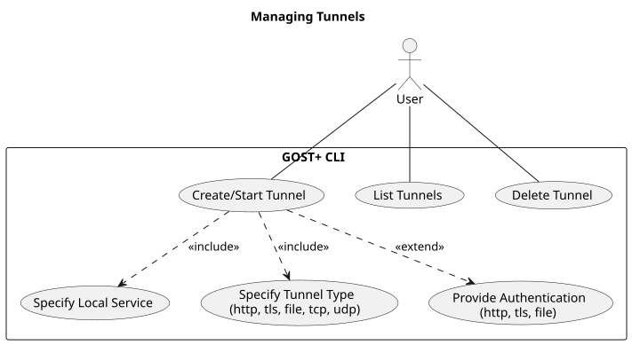
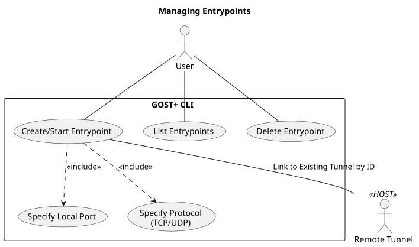

# GOST-PLUS CLI Tunnel

Instantly and securely share any local service with the world. `gost-tunnel` is user-friendly and a powerful, cross-platform CLI that creates encrypted tunnels to the [GOST.PLUS](https://gost.plus) network. Expose local web servers, SSH, databases, or share entire folders with a single command. It delivers a fast, reliable, ngrok-like experience with zero-config simplicity.

## Table of Contents
1. [Features](#features)
1. [Use Cases](#use-cases)
1. [Supported Tunnels](#supported-tunnels)
1. [Supported Entrypoints](#supported-entrypoints)
1. [Security](#security)
1. [Definitions](#definitions)
1. [Screenshots](#screenshots)
1. [Installation](#installation)
1. [Build](#build)
1. [Get started](#get-started)
1. [Commands](#commands)
1. [Folders and configuration](#folders-and-configuration)
1. [Logging](#logging)
1. [Unit Testing](#unit-testing)

## <a name="features"></a>Features:
🔐 **http -> https forwarding**: http to https tunnel forwarding by default<br>
💻 **Cross-Platform Support**: Runs/builds seamlessly on/for Linux, macOS, and Windows<br>
🚀 **Zero Configuration Mode**: Start tunneling with a single command<br>
🔧 **Configurable & Scriptable**: YAML config support and CLI flags<br>
💊 **Tunnel Monitoring & Auto-Recovery**: Automatic tunnel health monitoring and self-recovering<br>
🛠️ **Integrated Logging & Stats**: Real-time connection metrics and JSON logging for diagnostics<br>
⚙️ **Systemd Service Integration**: Easy deployment as a system service on Linux<br>

## 💡&nbsp;Use Cases:<a name="use-cases"></a>
✅ IoT device connectivity on edge devices such as Raspberry Pi<br>
✅ Https Webhook for bots<br>
✅ Secure file sharing for collaboration<br>
✅ Private API exposure<br>
✅ Ideal for rapid development prototyping<br>


## Supported Tunnels:<a name="supported-tunnels"></a>
* **HTTP Tunnel** - Exposes local web servers
* **File Tunnel** - Share local folders via web interface
* **TCP Tunnel**  - Forward any TCP service (e.g., databases, SSH)
* **UDP Tunnel**  - Forward UDP traffic (e.g., DNS, gaming)

## Supported Entrypoints:<a name="supported-entrypoints"></a>
* **TCP Entrypoint** - Connects to the remote address of a TCP tunnel by tunnel id
* **UDP Entrypoint** - Connects to the remote address of a UDP tunnel by tunnel id

## 🔐&nbsp;Security<a name="security"></a>
- **End-to-End Encryption**: All tunnel traffic is encrypted
- **Authentication**: Built-in support with username/password authentication for HTTP and File tunnel types
- **TLS Support**: Expose your HTTPS services with TLS tunnel
- **Password encoding**: Passwords in config are Base64 encoded for basic protection and passed via the environment variable.


## 📝&nbsp;Definitions<a name="more"></a>

### Tunnels

Tunnels are outbound connections from your local address to the GOST.PLUS infrastructure. They expose your local services to the internet through secure, encrypted connections.


### Entrypoints
Entrypoints are the receiving ends that connect to your tunnels. They listen to a local address, connect to a remote tunnel and forward incoming traffic through the established tunnel to the mapped local address. Each entrypoint must be paired with a tunnel using a unique tunnel ID.

## Screenshots<a name="screenshots"></a>

### Running with statistics


### Logging output


## Installation<a name="installation"></a>

### Binary release files

Download manually and install one from this page:   
[https://github.com/shinevit/gost-plus-cli/releases](https://github.com/shinevit/gost-plus-cli/releases)

### Web install for Linux/macOS

Install latest version from Bash shell:   
```bash
bash <(curl -fsSL https://github.com/shinevit/gost-plus-cli/raw/cli/install.sh) --latest
```

Select version for install:
```bash
bash <(curl -fsSL https://github.com/shinevit/gost-plus-cli/raw/cli/install.sh)
```

### Web install for Windows

Install latest version from PowerShell as Admin:   

```powershell
iex "& { $(irm https://github.com/shinevit/gost-plus-cli/raw/cli/install.ps1) } -Latest"
```

Select version for install:
```powershell
irm https://github.com/shinevit/gost-plus-cli/raw/cli/install.ps1 | iex
```

## 📦&nbsp;Build<a name="build"></a>
 
 ### Prerequisites
-   **Go**: Ensure you have Go installed (version 1.21 or higher recommended).
-   **go-winres**: For Windows builds, install `go-winres` to embed version information and an icon:
    ```bash
    go install github.com/tc-hib/go-winres@latest
    ```
-   **upx**: To compress the binaries

### Building for the current platform
```bash
go build -ldflags="-s -w" -o gost-tunnel main.go
# or build for the current platform
make
```

### Cross-Platform Build
To build for specific platforms, use the `make` commands:

-   **Linux (64-bit)**:
    ```bash
    make linux-amd64
    ```
-   **Raspberry Pi (ARMv7/armhf)**:
    ```bash
    make linux-armhf
    ```
-   **macOS (64-bit)**:
    ```bash
    make darwin-amd64
    # For Apple Silicon (ARM64)
    make darwin-arm64
    ```
-   **Windows (64-bit)**:
    ```bash
    make windows-amd64
    ```
Refer to [Makefile](Makefile) for more CPU architectures

## 🚀&nbsp;Get started<a name="get-started"></a>

1.  **Create and start a HTTP tunnel**:
    ```bash
    # Expose a local web server on port 8080
    gost-tunnel http 8080 -n my-web-server
    ```
    Once a tunnel or entrypoint is created, it's started and saved to the configuration.

2.  **Start all saved tunnels and entrypoints**:
    ```bash
    # The default command is 'start', which runs all saved configurations
    gost-tunnel start
    # or just
    gost-tunnel
    # or for a daemon service installed to linux
    gost-tunnel -no-stats
    ```

3.  **Using Entrypoints** (Connecting to Remote Tunnels)

    **On Host A (with the service):**
    ```bash
    # Create a TCP tunnel to expose the local SSH server (port 22)
    gost-tunnel tcp 22 -n SSH-Tunnel

    # Note the Tunnel ID from the output, e.g.: "ID: a7a1c126-970b-4886-8ff5-455902abcfd3"
    ```

    **On Host B (client machine):**
    ```bash
    # Create a TCP entrypoint that connects to the tunnel
    gost-tunnel bind a7a1c126-970b-4886-8ff5-455902abcfd3 -tcp localhost:2222 -n SSH-Access

    # Now you can connect to the remote SSH server via the local port
    ssh -p 2222 user@localhost
    ```
    <details>
    <summary>Visual workflow of using entrypoints</summary>

    
    </details><br>

4.  Run as a systemd service on Linux (optional):
    ```bash
    chmod +x ./install.sh
    ./install.sh
    ```

## ▶&nbsp;Commands<a name="commands"></a>

Each command provides detailed help with examples.<br>
To learn more, run any command with the `--help` or `-h` flag (e.g., `gost-tunnel http -h`).

### Tunnel Commands
-   **`http [host:]port`**: Creates an HTTP tunnel.
    ```bash
    # Simple tunnel
    gost-tunnel http localhost:8080 -n web-app
    # or for any internal network service
    gost-tunnel http 192.168.0.100:8080 -n web-app

    # With authentication
    AUTH_PASSWORD=secret gost-tunnel http 8080 -u my_user -n auth-app
    ```
-   **`tls [host:]port`**: Creates a secure HTTPS tunnel.
    ```bash
    # With authentication
    export AUTH_PASSWORD=secret
    gost-tunnel tls 443 -u my_user -n auth-secure-app
    ```
-   **`file <directory>`**: Shares a local directory over an HTTP tunnel.
    ```bash
    # With authentication
    export AUTH_PASSWORD=secret
    gost-tunnel file . -u my_user -n auth-shared-files
    ```
-   **`tcp [host:]port`**: Creates a TCP tunnel for services like SSH or databases.
    ```bash
    gost-tunnel tcp 22 -n ssh-access
    ```
-   **`udp [host:]port`**: Creates a UDP tunnel for services like DNS or gaming.
    ```bash
    gost-tunnel udp 53 -n dns-server
    ```
    <details>
    <summary>Tunnels use case diagram</summary>

    
    </details>
    <br>

### Entrypoint Command
-   **`bind <tunnel ID>`**: Binds an existing tunnel to a local TCP or UDP port.
    ```bash
    # Bind to a TCP port
    gost-tunnel bind <ID> -tcp localhost:2222 -n "Unique name"

    # Bind to a UDP port with a TTL
    gost-tunnel bind <ID> -udp 5353 -ttl 120s -n "Unique name"
    ```

    <details>
    <summary>Entrypoints use case diagram</summary>

    
    </details>
    <br>

### Management Commands
-   **`start [ID or -n name]`**: Starts a saved tunnel or entrypoint by ID or name. If no argument is given, starts all.
    ```bash
    gost-tunnel start a7a1c126-970b-4886-8ff5-455902abcfd3
    # or
    gost-tunnel start -n web-app
    ```
-   **`list, ls`**: Lists all saved tunnels and entrypoints.
-   **`tunnels, tl`**: Lists only tunnels.
-   **`entrypoints, el`**: Lists only entrypoints.
-   **`delete <ID>`, `d <ID>`**: Deletes a tunnel or entrypoint by its ID.

### Informational Commands
-   **`showConfig, sc`**: Displays the configuration file with sensitive values masked.
-   **`env`**: Shows relevant environment variables.
-   **`paths`**: Shows the paths to the configuration and log files.

### Global Options
-   `--stats-interval <duration>`, `-stats <duration>`: Sets the statistics update interval (default: 1s).
-   `--monitor-interval <duration>`, `-monitor <duration>`: Sets the connection monitoring interval for tunnels (default: 60s).
-   `--no-stats`: Disables real-time statistics, useful for daemon mode.
-   `--help`, `-h`: Shows help for the application or a specific command.
-   `--version`, `-v`: Shows the application version.

### Advanced Usage
```bash
# Create a secure TLS tunnel with authentication, a custom hostname,
# and specific monitoring intervals.
export AUTH_PASSWORD=my_secret_password
gost-tunnel tls 192.168.0.100:443 -n secure-api -u api-user -hostname api.example.com -stats 2s -monitor 2m
```

## 📁&nbsp;Folders and configuration<a name="folders-and-configuration"></a>

Find the locations of your configuration and a log file by running the `paths` command:
```bash
gost-tunnel paths
```

Default paths are:

**macOS**
- app dir: `/Users/[user]/Library/Application Support/gost.plus`
- app configuration file: `/Users/[user]/Library/Application Support/gost.plus/config.yml`
- app log file: `/Users/[user]/Library/Application Support/gost.plus/logs/gost-plus.log`

**Linux**
- app dir: `/home/[user]/.config/gost.plus`
- app configuration file: `/home/[user]/.config/gost.plus/config.yml`
- app log file: `/home/[user]/.config/gost.plus/logs/gost-plus.log`

## 🧾&nbsp;Logging<a name="logging"></a>
- Keep track pretty formatted logs:
```bash
tail -f "/Users/[user]/Library/Application Support/gost.plus/logs/gost-plus.log" | jq -C .
```

- Keep track logs without formatting
```bash
tail -f "/Users/[user]/Library/Application Support/gost.plus/logs/gost-plus.log" | jq -c .
```

## 🚦&nbsp;Unit Testing<a name="unit-testing"></a>

### Install required tools
```bash
go install github.com/xhd2015/xgo/cmd/xgo@latest
go install github.com/vektra/mockery/v3@v3.6.0
```

### Mocks generating
```bash
# Generate mocks for all interfaces
mockery --config=.mockery.yaml
```

### Running Tests

```bash
# To run all Unit tests:
xgo test -v ./tests/...

# To run specific Unit tests on a file:
xgo test -v ./tests/stats/stats_test.go

xgo test -v ./tests/utils/...

# To run a single test case:
xgo test -v -run ^TestGetState$ ./tests/utils/tunnel_test.go

xgo test -v -run TestDisplayStats_Shows_LatestStats_ForEntrypoints ./tests/stats/...
```

Start tests explorer on web browser:
```bash
xgo e
```

### Test Coverage

Check test coverage with the following commands:

```bash
# Generate coverage profile
xgo test -cover -coverpkg=./... -coverprofile=coverage.out ./...
# or
xgo test -cover -coverpkg=./runner/task/... -coverprofile=coverage.out ./...

# View coverage on Web browser
go tool cover -html=coverage.out
# or view the coverage on terminal
go tool cover -func=coverage.out

# Save coverage report to HTML file
go tool cover -html=coverage.out -o coverage.html
```
